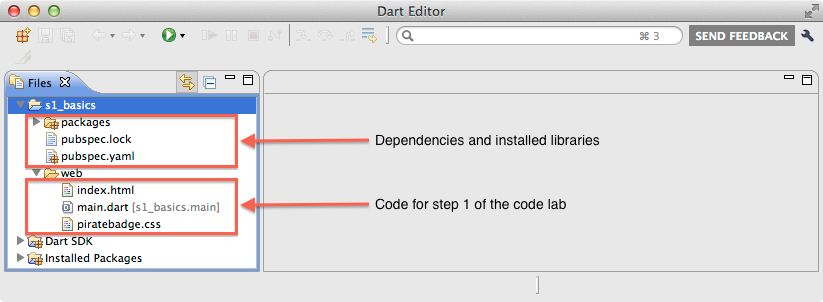

## Step 0: Set up

In this step, you download Dart and get the sample code.

### Get Dart.

If you haven’t already done so, get the Dart download
by clicking the big **Download Dart + Editor**
button on the Dart homepage.

> **<a href="http://www.dartlang.org" target="_blank">Download Dart + Editor</a>**

Unzip the ZIP file, which creates a directory called `dart`.

### Start the editor.

Go to the `dart` directory and double-click **DartEditor**.

**Got questions? Having trouble?** Go to the
[Troubleshooting Dart Editor](https://www.dartlang.org/tools/editor/troubleshoot.html) page.

###  Get the sample code.

[Download the sample code.](https://github.com/angular/ng-darrrt-codelab/archive/master.zip)
{**NO, WAIT, DON'T! [PENDING]:**
Until the revamp branch becomes the master branch, download this instead:
https://github.com/angular/ng-darrrt-codelab/archive/revamp.zip}

Unzip the ZIP file,
which creates a directory called `ng-darrrt-codelab-master`.
{**Note [PENDING]:**
Until the revamp branch becomes the master branch,
the directory is `ng-darrrt-codelab-revamp`, not `ng-darrrt-codelab-master`.}

### Open the sample.

In Dart Editor, use **File > Open Existing Folder...**
to open the directory `ng-darrrt-codelab-master/samples/s1-basics`.

Next, open the `web` directory by
clicking the little arrow ► to the left of its name.

.

[PENDING: delete `img/fileview.png`]

**Note:**
If you see red X’s
at the left of the filenames or if the `packages` directory doesn't appear,
the packages are not properly installed.
Right-click `pubspec.yaml` and select **Pub Get**.

## [Home](../README.md) | [Next >](step-1.md#step-1-run-the-app-and-view-its-code)
