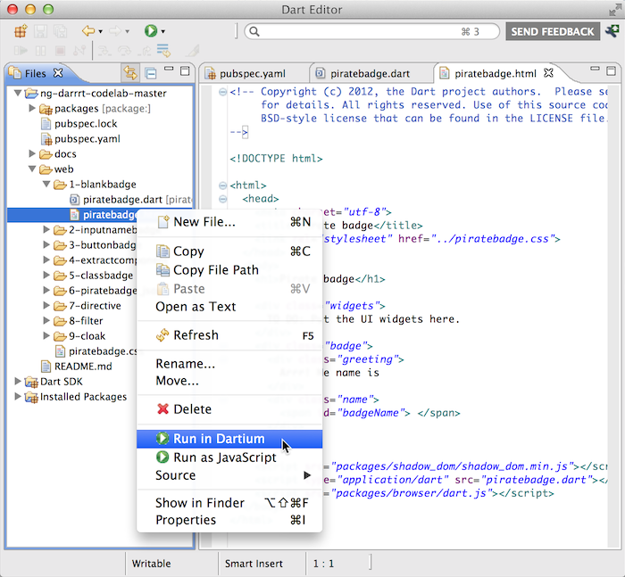

## Step 1: Run the app, and view its code

In this step, you open the source files, familiarize yourself with the Dart and HTML code, and run the app.

_**Keywords**: main, pub, Dartium, Angular_


### Open ng-darrrt-codelab-master in Dart Editor.

In Dart Editor, use **File > Open Existing Folder...** to open
`ng-darrt-codelab-master`.

### Open 3 source files.

In Dart Editor, open `pubspec.yaml` (in the top directory) by
double-clicking its filename.

Still in Dart Editor,
expand the `web` directory and its subdirectory `1-blankbadge` by
clicking the little arrows ► to the left of their names. 
Under `web/1-blankbadge`,
double-click `piratebadge.html` and `piratebadge.dart`.

.

### Review the code.

Get familiar with `pubspec.yaml`, and with the HTML and the Dart code
for the skeleton version of the app.

#### pubspec.yaml
  
The `pubspec.yaml` file in the project root gives information
about this app and the packages it depends on.
In particular, the dependency on **angular** gives the Dart tools
the information they need to download the
[angular package from pub.dartlang.org](https://pub.dartlang.org/packages/angular).

``` yaml
name: ng-darrrt-codelab
description: A one hour exercise, based on the Darrrt project, to learn AngularDart.
dependencies:
    angular: any
    browser: any
```

Key information:

* Thanks to this file, you can define the name, the description of our project and many dependencies by adding a `name_of_your_dependency: version_of_your_dependency` line in the `dependencies` section (be careful, the YAML format that is used by the pubspec file is sensitive to indentation). In our case, we define that the project needs any version of the `browser`, `shadow_dom` and the `angular` packages.
* The `browser` package is used in Dart browser apps to check for native Dart support and either (a) bootstrap Dartium or (b) load compiled JS instead.
* The `angular` package is the port of the Angular framework in Dart.
* Dart packages are stored and listed on [pub.dartlang.org](http://pub.dartlang.org/).


#### piratebadge.html

```HTML
<html>
  <head>
    <meta charset="utf-8">
    <title>Pirate badge</title>
    <link rel="stylesheet" href="../piratebadge.css">
  </head>
  <body>
    <h1>Pirate badge</h1>
    
    <div class="widgets">
      TO DO: Put the UI widgets here.
    </div>
    <div class="badge">
      <div class="greeting">
        Arrr! Me name is
      </div>
      <div class="name">
        <span id="badgeName"> </span>
      </div>
    </div>

    <script src="packages/shadow_dom/shadow_dom.min.js"></script>
    <script type="application/dart" src="piratebadge.dart"></script>
    <script src="packages/browser/dart.js"></script>
  </body>
</html>
```
Key information:
- The first `<script>` tag is here to emulate ShadowDom on browsers that don't support this natively.
- The second `<script>` tag identifies the main file that implements the app. Here, it’s the `piratebadge.dart` file.
- The Dart Virtual Machine (Dart VM) runs Dart code natively.
  The Dart VM is built into Dartium, a special build of the Chromium browser
  in which you can run Dart apps natively.
- The `packages/browser/dart.js` script checks for native Dart support and
   either bootstraps the Dart VM or loads compiled JavaScript instead.

#### piratebadge.dart
  
```Dart
void main() {
  // Your app starts here.
}
```

Key information:
* This file contains the entry point for the app—the `main()` function.
  The `<script>` tags in the `piratebadge.html` file start the application
  by running this function.
* The `main()` function is a top-level function.
* A top-level variable or function is one that is declared outside
  a class definition.

### Run the app.

To run the app in Dart Editor, right-click `piratebadge.html` and select **Run in Dartium**.

.

Dart Editor launches _Dartium_, a special build of Chromium that has the Dart Virtual Machine built in, and loads the `piratebadge.html` file. 
The `piratebadge.html` file loads the app and calls the `main()` function.  
You should see a TO DO comment on the left and a red and white name badge on the right.

## [Home](../README.md) | [Next >](step-2.md)
