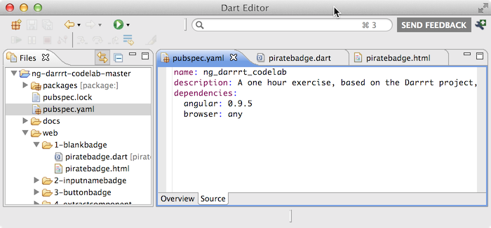

## Step 1: Run the app, and view its code

In this step, you open the app's source files, familiarize yourself with its code,
and run the app.

_**Keywords**: main, pub, Dartium, Angular_


### Open ng-darrrt-codelab-master in Dart Editor.

In Dart Editor, use **File > Open Existing Folder...** to open
`ng-darrt-codelab-master`.

### Open 3 source files.

In Dart Editor, open `pubspec.yaml` (in the top directory) by
double-clicking its filename.
To see its raw source code,
click the **Source** tab at the bottom of the edit view.

Still in Dart Editor,
expand the `web` directory and its subdirectory `1-blankbadge` by
clicking the little arrows ► to the left of their names.
Under `web/1-blankbadge`,
double-click `piratebadge.html` and `piratebadge.dart`.

.

### Review the code.

Get familiar with `pubspec.yaml`, and with the HTML and the Dart code
for the skeleton version of the app.

#### pubspec.yaml

The `pubspec.yaml` file in the project root gives information
about this app and the packages it depends on.
In particular, the dependency on **angular** gives the Dart tools
the information they need to download the
[angular package](https://pub.dartlang.org/packages/angular).

``` yaml
name: ng-darrrt-codelab
description: A one hour exercise, based on the Darrrt project, to learn AngularDart.
dependencies:
    angular: 0.9.5
    browser: any
    shadow_dom: any
```

Key information:

* All AngularDart apps depend on `angular` and
  (to accommodate browsers that don't yet support Shadow DOM) `shadow_dom`.
* Like most Dart web apps, this app also depends on `browser`.
* Angular depends on other packages (including `browser`, as it happens).
  The pub package manager automatically finds the right versions of these packages.
* You can find many Dart packages, including angular,
  on [pub.dartlang.org](http://pub.dartlang.org/).
* For more information about the pub package manager, see the
  [pub documentation](https://www.dartlang.org/tools/pub/).


#### piratebadge.html

The first version of this HTML file contains no Angular code.
However, it does set you up to add Angular code in the next step.

```HTML
<html>
  <head>
    <meta charset="utf-8">
    <title>Pirate badge</title>
    <link rel="stylesheet" href="../piratebadge.css">
  </head>
  <body>
    <h1>Pirate badge</h1>

    <div class="widgets">
      TO DO: Put the UI widgets here.
    </div>
    <div class="badge">
      <div class="greeting">
        Arrr! Me name is
      </div>
      <div class="name">
        <span id="badgeName"> </span>
      </div>
    </div>

    <script src="packages/shadow_dom/shadow_dom.min.js"></script>
    <script type="application/dart" src="piratebadge.dart"></script>
    <script src="packages/browser/dart.js"></script>
  </body>
</html>
```
Key information:
- The first `<script>` tag emulates Shadow DOM on browsers that don't support it natively.
- The second `<script>` tag identifies the main file that implements the app.
  Here, it’s the `piratebadge.dart` file.
- The `packages/browser/dart.js` script checks for native Dart support and
  either bootstraps the Dart VM or loads compiled JavaScript instead.
- Dartium is a special build of the Chromium browser
  that has a Dart VM, so it can run Dart apps natively.

#### piratebadge.dart

This version of the app does nothing,
and has almost no Dart code.
In the next step, you'll add some code.

```Dart
void main() {
  // Your app starts here.
}
```

Key information:
* This file contains the entry point for the app—the `main()` function.
  The `<script>` tags in the `piratebadge.html` file start the application
  by running this function.
* The `main()` function is a top-level function.
* A top-level variable or function is one that is declared outside
  a class definition.

### Run the app.

To run the app in Dart Editor, right-click `piratebadge.html` and select **Run in Dartium**.

.

Dart Editor launches _Dartium_, a special build of Chromium that has the Dart Virtual Machine built in, and loads the `piratebadge.html` file.
The `piratebadge.html` file loads the app and calls the `main()` function.
You should see a TO DO comment on the left and a red and white name badge on the right.

## [Home](../README.md) | [< Previous](step-0.md) | [Next >](step-2.md)
